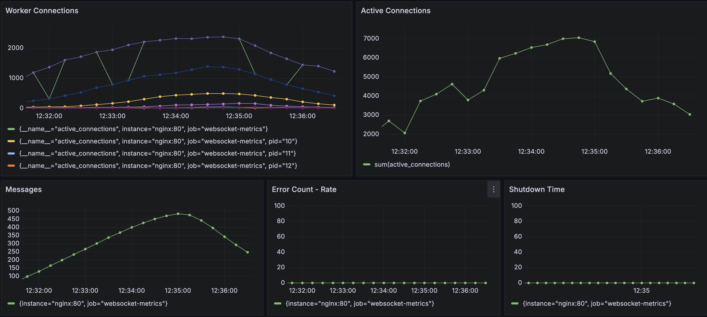

# Django WebSocket Blue/Green Deployment

A production-ready Django-based WebSocket service with zero-downtime blue/green
Docker Compose deployment, observability, and health checks.



## 🚀 Features

* **Blue/Green Deployment** via Docker Compose (nginx reverse proxy with
  `app_blue` and `app_green` services)
* **WebSocket Endpoint** at `/ws/chat/` powered by Uvicorn + Django Channels
* **Observability** with Prometheus metrics (`/metrics`) and Grafana dashboards
* **Health Checks**: `/healthz` (liveness) and `/readyz` (readiness)
* **Automation Scripts**:

  * `scripts/promote.sh`: Flip traffic from blue to green
  * `scripts/monitor.sh`: Tail logs for errors and print top‑5 Prometheus
    counters every 10 s
  * `scripts/ws_test.js`: k6 load test script for WebSocket performance

## ⚙️ Prerequisites

* Docker >= 27.0.0
* Docker Compose >= 2.29.0

## 🛠️ Quick Start

### 1. Clone the repository

```bash
git clone git@github.com:prxssh/prod-websocket-service && cd prod-websocket-service
```

### 2. Build and start the full stack

This command first spins up the required prerequisites for the application
(Grafana, dashboards, k6, nginx) and then starts both app_blue and app_green
services.

```bash
docker-compose --env-file dev.env -f docker/compose.yml up -d
```

### 3. Verify Services

* **WebSocket**: `ws://localhost:80/ws/chat/?session=<uid>`
* **Liveness**: `http://localhost:80/healthz`
* **Readiness**: `http://localhost:80/readyz`
* **Metrics**: `http://localhost:80/metrics`
* **Grafana**: `http://localhost:3000` (default credentials `admin/admin`)

## ⚡ Blue/Green Deployment

To flip traffic from the current color to the standby color:

```bash
./scripts/promote.sh
```

This script will:

1. Build and start the next color stack
2. Run smoke tests against `/healthz`
3. Update nginx to route traffic
4. Tear down the old color stack

## 📊 Monitoring

Tail real-time logs for errors and see top‑5 Prometheus counters:

```bash
./scripts/monitor.sh
```

## 💥 Load Testing

By default, Docker Compose will run the k6 load test automatically when the
application starts, writing results to k6-results/ (or you can view them via
the k6 container logs).

To run the load test manually, execute:

```bash
k6 run scripts/ws_test.js
```

## 📚 Further Reading

* See [DESIGN.md](docs/DESIGN.md) for concurrency and deployment rationale
* See [OBSERVABILITY.md](docs/OBSERVABILITY.md) for Prometheus/Grafana setup
